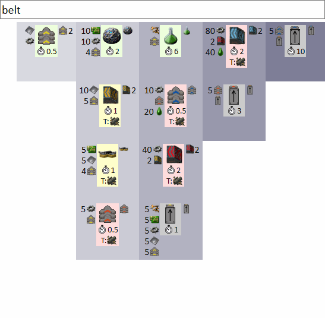

Proof of concept for Factorio recipe explorer tool.

aprillion.github.io/recipe_explorer

    
Preview (click here to collapse)

    

## Notes
### [dump_json.lua](dump_json.lua)
- copy&paste to Factorio console (press ` in a game)
- go to [User Data directory](https://wiki.factorio.com/Application_directory#User_Data_directory) and get `scripts_output/recipe_explorer/*.json` files
- clone this repo and replace json files with those extracted from game
- copy icons from your mods to `factorio-content`
- open index.html in Firefox
- TODO: make a mod for exporting via console command or shortcut or automatically when loading/saving

### [index.html](index.html)
- recipes sorted by dependencies to 8 columns, recipes on right require ingredients from products of recipes on the left (note: columns are wrapping on narrow screens)
- each recipe has ingredients on the left, products on the right, energy and unlocking technology at the bottom
- tooltips display the internal "name" property of recipe/item/fluid/technology (no localization yet)
- background color based on technology availability: green = available, yellow = possible to research next, red = possible to research later, gray = not possible to research - only to enable via console command: 
`/c game.player.force.recipes["recipe-name"].enabled = true`
- TODO: change json to js scripts so opening from file system works in Chrome, load icons from mods (popular ones maybe on github too), ... switch from paper to github issues
